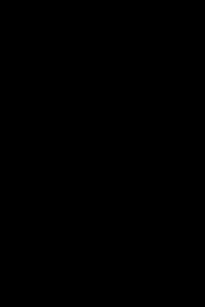

# Distance Estimation Between Moving Cameras and Objects

A computer vision system that calculates distances to road objects (vehicles, pedestrians, cyclists) in real-time using monocular depth estimation and object detection. Built for driving safety applications.

<p align="center">
  
</p>

## Overview

This project combines **Apple's ML-Depth-Pro** depth estimation model with **YOLO11** object detection to provide real-time distance measurements to road objects from a single camera feed. The system is designed for potential use in driving assistance systems, driving safety research.

## Features

- **Real-time processing** of video streams
- **Monocular depth estimation** - works with single camera (no stereo required)
- **Multi-object tracking** with persistent IDs across frames
- **Risk classification** (Dangerous/Cautious/Safe) based on distance
- **Temporal smoothing** for stable distance estimates
- **Performance optimisations** including frame skipping and half-precision inference
- **Batch processing mode** for offline video analysis

## Implementation

### Components

1. **Object Detection**: YOLO11s for real-time detection of road-relevant classes

   - Detects: vehicles (car, truck, bus, motorcycle), pedestrians, cyclists
   - Tuned confidence thresholds for safety applications

2. **Depth Estimation**: Apple ML-Depth-Pro

   - Monocular metric depth (absolute scale without camera calibration)
   - High-resolution depth maps with sharp boundaries
   - Fast inference (~0.3s per frame on standard GPU)

3. **Object Tracking**: IoU-based tracking algorithm

   - Maintains consistent object IDs across frames
   - Handles occlusions and temporary disappearances

### Technologies Used

- **Python 3.9+**
- **PyTorch** - Deep learning framework
- **Ultralytics YOLO11** - Object detection
- **Apple ML-Depth-Pro** - Monocular depth estimation
- **OpenCV** - Bouding box utilities

## Installation

### Prerequisites

- Python 3.9 or higher
- CUDA-capable GPU or Apple Silicon Mac using MPS

### Setup

1. **Clone the repository**

```bash
git clone https://github.com/yourusername/road-object-distance-estimation.git
cd road-object-distance-estimation
```

2. **Create virtual environment**

```bash
python -m venv venv
source venv/bin/activate
```

3. **Install dependencies**

```bash
pip install -e .
pip install ultralytics opencv-python
```

4. **Download ML-Depth-Pro model weights**

```bash
source get_pretrained_models.sh
# Downloads checkpoint to ./checkpoints/depth_pro.pt
```

## Usage

### Basic Camera Usage

```bash
python main.py
```

### Process Video File

```bash
python main.py --video path/to/video.mp4
```

### Save Annotated Output

```bash
python main.py --video input.mp4 --output annotated_output.mp4
```

### Show Depth Map Visualization

```bash
python main.py --video input.mp4 --show_depth
```

### Batch Processing (No Display)

```bash
python main.py --video input.mp4 --output output.mp4 --batch_process
```

### Performance Optimisation

```bash
# Use smaller input resolution for faster processing
python main.py --video input.mp4 --resize_factor 0.5

# Use faster YOLO model
python main.py --yolo_model yolo11n.pt

# Disable optimisations (for debugging)
python main.py --no_optimisation
```

### Full Example

```bash
python main.py --video videos/driving.mp4 --output annotated_videos/driving_analyzed.mp4 --batch_process --resize_factor 0.5 --yolo_model yolo11s.pt
```

## Project Structure

```
road-object-distance-estimation/
├── src/
│   ├── depth_pro/                # ML-Depth-Pro model code
│   └── scripts/
│       ├── depth_estimator.py    # Depth estimation wrapper
│       └── yolo_detect.py        # YOLO detection + tracking
├── main.py                       # Main application entry point
├── checkpoints/                  # Model weights (downloaded)
├── README.md
├── requirements.txt
└── .gitignore
```

## Limitations

- **Single camera**: No stereo depth information
- **Computational cost**: Requires GPU for real-time performance
- **Weather conditions**: Performance may degrade given different weather conditions
- **Depth accuracy**: Monocular depth has inherent scale ambiguity
- **Small objects**: Distance estimation less reliable for distant small objects

## Future Improvements

- Add lane detection for more context when assessing risk
- Support for multiple camera angles
- Export distance logs for analysis

## Acknowledgments

This project builds upon the work of:

- **[Apple ML-Depth-Pro](https://github.com/apple/ml-depth-pro)** - Monocular depth estimation
  - Bochkovskii et al., "Depth Pro: Sharp Monocular Metric Depth in Less Than a Second"
- **[Ultralytics YOLO11](https://github.com/ultralytics/ultralytics)** - Object detection

## License

This project uses Apple's ML-Depth-Pro under their [license terms](LICENSE).
See the original [Apple repository](https://github.com/apple/ml-depth-pro) for details.

## Author

**Matthew Privitera**

- GitHub: [@mattpri22](https://github.com/mattpri22)
- Email: matthewprivitera@gmail.com

## Citation

If you use this project in your research, please cite the original Depth Pro paper:

```bibtex
@inproceedings{Bochkovskii2024:arxiv,
  author     = {Aleksei Bochkovskii and Ama\"{e}l Delaunoy and Hugo Germain and Marcel Santos and
               Yichao Zhou and Stephan R. Richter and Vladlen Koltun},
  title      = {Depth Pro: Sharp Monocular Metric Depth in Less Than a Second},
  booktitle  = {International Conference on Learning Representations},
  year       = {2025},
  url        = {https://arxiv.org/abs/2410.02073},
}
```
